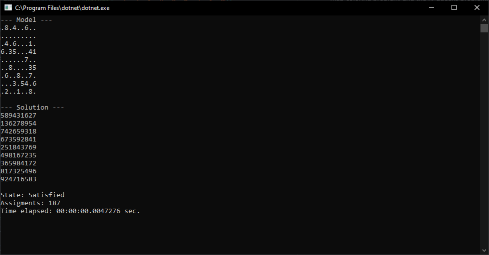

# Solving Sudoko as a Constraint Satisfaction Problem (CSP) with Forward Propagation

This project is a constraint satisfaction problem (CSP) solver which is adjusted to solve Sudoku puzzles. As a result, this solver is optimized to solve `AllDiff` constraints, and is also suitable for the map coloring problem, and the N-queens problem.



The Sudoku puzzle is provided as a single string consisting of 81 characters, e.g.:

`.8.4..6............4.6...1.6.35...41......7....8....35.6..8..7....3.54.6.2..1..8.`.

It supports either `0` or `.`, or actually any other character, as the specifier for an empty field.

This website can be used (https://qqwing.com/generate.html) to generate more Sudoku strings, just set the output to single line.

## CSP

A constraint satisfaction problem (CSP) is described in the following way:

 * Domains `D`, which are the values that can be assigned to the variable. In the case of Sudoku, the domain is `{1, 2, 3, 4, 5, 6, 7, 8, 9}`.
 * Variables `V` holds a value and a domain. In the case of Sudoku, there are `81` variables for each cell.
 * Contraint `C` is a list of constraints that must be satisfied. In the case of Sudoku, each row/column/square is constrained in a `AllDiff(...)` constraint. This gives a total of `27` constraints.

## Algorithm

It uses a recursive backtracking algorithm with forward propagation to solve the CSP problem. The backtracking procedure works like this:

```
function Search
    if all variables are set, check if the solution is consistent
        if the solution is consistent, then we have found a solution
    
    get the next variable V
    for each value in the domain of V
        assign the value to V
        recursively call search to continue to the next variable
        unassign the value from V (backtracking step)
```

### Forward propagation

If we assign a value to a variable, we can remove this value from all the other variable domains that share the same constraint. If it happens that a domain becomes empty, we know that we have an infeasible solution, and we can backtrack early.

The algorithm uses a `ConstraintPropagator` which will propagate the value after a variable is set. The propagator will return a `Propagation` object with information of which values have been removed (`Reduction`) from the domains of other variables. This is required, because if we unset the value of the variable, we also need to restore the domains which we have reduced.

### Variable order heuristic

To pick the variable which is going to be set, a heuristic is used which will return the least amount of values, this is also called the minimum remaining values heuristic (MRV). This will ensure that the algorithm fails fast, and the search space is reduced quickly. 

Some Sudoku's can be solved with only foward propagation. If we propagate a value, and a variable will be left with only one value in the domain, we could already set this value. However, this assignment then needs another propagation step, because a new value is set. Instead of assigning all the variables which just have a single value remaining in the domain, the recursive backtracking algorithm will do this step. This seemed the easiest choice. Because of the MRV heuristic, this variable will already be assigned immediately, giving the same effect as doing this in the forward propagation algorithm.

### Value order heuristic

Another common heuristic is to select the ordering of the values based on how many cells it will propagate to. In this case the value with the most propagation will be picked, because this gives more flexibility to the algorithm later on. I however, found that it increases the runtime, and even worse, it took the algorithm more assignments to solve the CSP. Instead of this, the values are picked in lexicographical order. The solver has an option available to change this heuristic.

## The hardest Sudoku

The hardest Sudoku is the following Sudoku string:

`800000000003600000070090200050007000000045700000100030001000068008500010090000400`

It takes the algoritm a bit less than 30 milliseconds, and 14.372 assigments, to solve this one.

```
--- Model ---
8........
..36.....
.7..9.2..
.5...7...
....457..
...1...3.
..1....68
..85...1.
.9....4..

--- Solution ---
812753649
943682175
675491283
154237896
369845721
287169534
521974368
438526917
796318452

State: Satisfied
Assigments: 14372
Time elapsed: 00:00:00.0279840 sec.
```

## Usage example with map coloring problem

The algorithm will solve any CSP model with only `AllDiff` constraints rather efficiently. It could be used for the N-Queens problem, and also for the map coloring problem.

The example code below shows how to construct the map coloring problem.

```cs
var model = new ModelBuilder();
var domain = model.CreateDomain("colors", Red, Green, Blue);
var wa = model.CreateVariable("Western Australia", domain);
var nt = model.CreateVariable("Northern Territory", domain);
var sa = model.CreateVariable("South Astralia", domain);
var qe = model.CreateVariable("Queensland", domain);
var nsw = model.CreateVariable("New South Wales", domain);
var vi = model.CreateVariable("Victoria", domain);
model.CreateAllDifferentConstraint(wa, nt);
model.CreateAllDifferentConstraint(wa, sa);
model.CreateAllDifferentConstraint(nt, sa);
model.CreateAllDifferentConstraint(nt, qe);
model.CreateAllDifferentConstraint(sa, qe);
model.CreateAllDifferentConstraint(sa, nsw);
model.CreateAllDifferentConstraint(sa, vi);
model.CreateAllDifferentConstraint(nsw, vi);
```

The algorithm will solve this problem with just 6 assignments.

```
--- Model ---
Western Australia {0, 1, 2} = 0 (Set: False)
Northern Territory {0, 1, 2} = 0 (Set: False)
South Astralia {0, 1, 2} = 0 (Set: False)
Queensland {0, 1, 2} = 0 (Set: False)
New South Wales {0, 1, 2} = 0 (Set: False)
Victoria {0, 1, 2} = 0 (Set: False)

--- Solution ---
Western Australia {1, 2} = 0 (Set: True)
Northern Territory {2} = 1 (Set: True)
South Astralia {} = 2 (Set: True)
Queensland {} = 0 (Set: True)
New South Wales {1} = 0 (Set: True)
Victoria {} = 1 (Set: True)

State: Satisfied
Assigments: 6
Time elapsed: 00:00:00.0029048 sec.
```